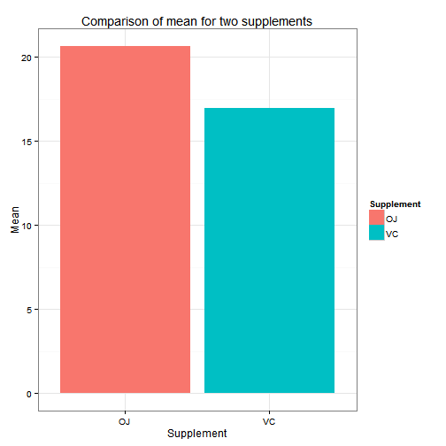

# 1. Project Description 
This project investigates the exponential distribution in R and compares it with the Central Limit Theorem. The exponential distribution can be simulated in R with **rexp(n,lambda)** where lambda is the rate parameter. The mean of exponential distribution is 1/lambda and the standard deviation is also 1/lambda. Set **lambda = 0.2** for all of the simulations. You will investigate the distribution of mean of 40 exponentials. Note that you will need to do **1000** simulations. 

This report covers the following objectives:

1. Show the sample mean and compare it to the theoretical mean of the distribution.  
2. Show how variable the sample is (via variance) and compare it to the theoretical variance of the distribution.  
3. Show that the distribution is approximately normal.  

# 2. Simulation Criteria and Results

Parameters for Simulation

```r
set.seed(120)
sim_cnt <-1000
lambda <-0.2
n<-40
```

Generate 1000 samples of 40 exponentials

```r
sim_mean<-NULL
for(i in 1:1000){
     sim_mean<-c(sim_mean,mean(rexp(n,lambda)))
}
```

The histogram of the mean of 1000 samples

```r
hist(sim_mean,col="blue")
```

 

The **mean** of 1000 sample means

```r
mean(sim_mean)
```

```
## [1] 5.03946
```
The **standard deviation** of 1000 sample means

```r
sd(sim_mean)
```

```
## [1] 0.7865754
```
The **variance** of 1000 sample means

```r
var(sim_mean)
```

```
## [1] 0.6187008
```

# 3. Comparing Sample mean to the theorretical mean 

The theoretical mean = $\frac{1}{\lambda}$ = $\frac{1}{0.2}$ = 5.  

From the above simulation, the estimate value of the mean of the 1000 sample means is 5.0394598. The value is very close to theoretical mean, with a difference of only 0.0394598. 

# 4. Comparing sample variance to the theoretical variance

The population standard deviation = $\frac{1}{lambda}$.    
Theoretical variance of sample mean = $\frac{(\frac{1}{lambda})^2}{n}$   
Therefore, theoretical variance of sample mean = $\frac{5^2}{40}$ = 0.625    
Slight different between the variance of sample means (from simulation) and theoretical variance of sample mean, that is 0.6187008 - 0.625 = -0.0062992


```r
dt<-data.frame(x=factor(rep("A",1000)), simulated_mean=sim_mean, 
               theoretical_value=rnorm(1000,5))

library(ggplot2)

ggplot(dt, aes(x=simulated_mean)) +
    geom_histogram(aes(y=..density..), binwidth=.5, colour="black", fill="white")+
     geom_density(aes(x=sim_mean), colour="red", data=dt) + 
  geom_density(aes(x=theoretical_value), colour="blue", data=dt)+
     theme_bw() 
```

 
