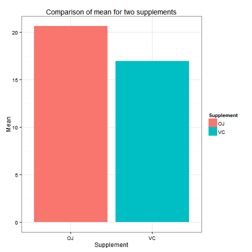

#  Project Description 

This project uses ToothGrowth data. The dataset has three columns, namely, *len*, *supp*, and *dose*. *len* represents the length of tooth while *supp* denotes the supplements treated to the sample. *dose* represents the different dose given in the experiment.

###  Load ToothGrowth dataset and some basic exploratory data analyses 

***First 10 rows in ToothGrowth dataset***


```r
head(ToothGrowth,10)
```

```
##     len supp dose
## 1   4.2   VC  0.5
## 2  11.5   VC  0.5
## 3   7.3   VC  0.5
## 4   5.8   VC  0.5
## 5   6.4   VC  0.5
## 6  10.0   VC  0.5
## 7  11.2   VC  0.5
## 8  11.2   VC  0.5
## 9   5.2   VC  0.5
## 10  7.0   VC  0.5
```

***Summary of ToothGrowth dataset***

```r
summary(ToothGrowth)
```

```
##       len        supp         dose      
##  Min.   : 4.20   OJ:30   Min.   :0.500  
##  1st Qu.:13.07   VC:30   1st Qu.:0.500  
##  Median :19.25           Median :1.000  
##  Mean   :18.81           Mean   :1.167  
##  3rd Qu.:25.27           3rd Qu.:2.000  
##  Max.   :33.90           Max.   :2.000
```

***Comparison of the mean for tooth length based on two types of supplements***


```r
library(ggplot2)
library(data.table)

dt<-data.table(ToothGrowth)
dt.mean <- dt[,mean(len),by=supp]
ggplot(dt.mean,aes(x=supp, y=V1,fill=supp)) + geom_bar(stat="identity") + labs(x="Supplement",y="Mean", title="Comparison of mean for two supplements", fill="Supplement") + theme_bw()
```

 

###  t-test for comparing two different types of supplements on growth length

The assumption is that the supplements are independent of each other.
The formula has **len~supp** because len is numeric while supp is factor.


```r
t.test(len ~ supp, data = ToothGrowth)
```

```
## 
## 	Welch Two Sample t-test
## 
## data:  len by supp
## t = 1.9153, df = 55.309, p-value = 0.06063
## alternative hypothesis: true difference in means is not equal to 0
## 95 percent confidence interval:
##  -0.1710156  7.5710156
## sample estimates:
## mean in group OJ mean in group VC 
##         20.66333         16.96333
```

**Conclusion**   
p-value > 0.05, therefore suggesting that there is no statistically significant difference in ***len*** given the two different groups OJ and VC.

###  t-test for comparing different types of doses on growth length

This type of t-test is independent 2-group t-test, with the assumption that two types of doses have no relation or dependency between them.

```r
t.test(ToothGrowth$len,ToothGrowth$dose)
```

```
## 
## 	Welch Two Sample t-test
## 
## data:  ToothGrowth$len and ToothGrowth$dose
## t = 17.81, df = 59.798, p-value < 2.2e-16
## alternative hypothesis: true difference in means is not equal to 0
## 95 percent confidence interval:
##  15.66453 19.62881
## sample estimates:
## mean of x mean of y 
## 18.813333  1.166667
```

**Conclusion**     
p-value < 0.05, therefore suggesting that is a statistically significant difference between the types of doses in growth length.
